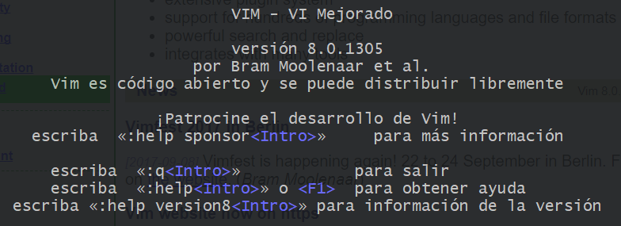
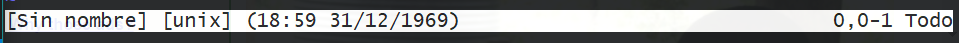
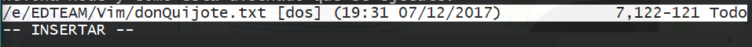
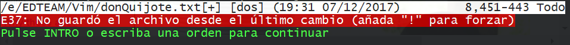

- [**Vim**](#vim)
- [**1. Comandos básicos**](#1-comandos-b%C3%A1sicos)
  - [Abrir VIM](#abrir-vim)
  - [Modos de trabajo de VIM](#modos-de-trabajo-de-vim)
    - [normal](#normal)
      - [¿Como sabemos que estamos en este modo?](#%C2%BFcomo-sabemos-que-estamos-en-este-modo)
      - [atajos para agilizar la navegación](#atajos-para-agilizar-la-navegaci%C3%B3n)
    - [insertar](#insertar)
      - [Como acceder al modo insertar](#como-acceder-al-modo-insertar)
      - [como salir del modo insertar](#como-salir-del-modo-insertar)
        - [salir sin guardar los cambios](#salir-sin-guardar-los-cambios)
        - [salir y guardar los cambios](#salir-y-guardar-los-cambios)
        - [atajo para salir y guardar con un solo comando](#atajo-para-salir-y-guardar-con-un-solo-comando)
- [**2. Moverse dentro de un archivo**](#2-moverse-dentro-de-un-archivo)
  - [:edit](#edit)
  - [atajos para agilizar la navegacion parte II](#atajos-para-agilizar-la-navegacion-parte-ii)
- [**3. Editar documentos**](#3-editar-documentos)
  - [MODO Visual](#modo-visual)
- [**4. Buscar y Reemplazar**](#4-buscar-y-reemplazar)
  - [buscar palabras](#buscar-palabras)
  - [buscar con regexp](#buscar-con-regexp)
  - [reemplazar](#reemplazar)
  - [como usar ctrl z](#como-usar-ctrl-z)
- [Recursos](#recursos)

# **Vim**

# **1. Comandos básicos**

Editar nuestros archivos desde la consola, es algo que como desarrolladores debemos de saber.

Tenemos a varios editores desde la consola como `nano` y `vim` que son las más conocidas.

En este caso usaremos `VIM`

* http://www.vim.org/
* https://vim.sourceforge.io/

## Abrir VIM

Usamos el comando
```
vim
```

Y nos resultará:



que nos pondra en conocimiento algunos comandos básicos como:
* `:help sponsor<Intro>` para mas imformacion de un comando
* `:q` para salir
* `:help<Intro>` para obtener ayuda
* `:help version8<Intro>` para mas imformacion de la version

## Modos de trabajo de VIM

### normal 

Con este modo solo podremos navegar por el documento. 

#### ¿Como sabemos que estamos en este modo?

Sabemos que estamos en este modo porque en la parte inferior nos muestra solo la info del archivo:



Para abrir un archivo con vim que por defecto será en modo normal:

```bash
vim nombreArchivo.txt
```

#### atajos para agilizar la navegación

Lo que VIM hace es agilizar la navegación usando los atajos que reemplazan a las flechas del teclado:

* `h` => left (caracter)
* `j` => down (linea)
* `k` => up (linea)
* `l` => right (caracter)

Si nosotros queremos insertar info al documento tenemos que acceder a otro modo que es:

### insertar

Nos permite insertar info en nuestro archivo

#### Como acceder al modo insertar

Pulsamos `i` y vemos que cambia en la parte de abajo a:



Y con esto ya podemos insertar info al documento

#### como salir del modo insertar

Nos salimos presionando la tecla `ESC`, y con esto regresamos al modo `normal`.

Ya cuando queremos salir de VIM presionamos `:q` pero nos aparecera esta advertencia:



##### salir sin guardar los cambios

Si quieres `salir sin guardar los cambios` añade `!`, si lo usamos:

```
:q!
```

Y listo salimos sin guardar los cambios que hicimos en este modo de insertar.

##### salir y guardar los cambios

Usamos el comando

```
:w
```

Y luego usamos `:q` para salir, Como podemos ver estamos haciendo uso de dos comandos `:q` y `:w`

##### atajo para salir y guardar con un solo comando

Pues simplemente fusionamos los comandos a:

```
:wq
```

y fin.

# **2. Moverse dentro de un archivo**

## :edit

Lo usamos para abrir un archivo desde `VIM`

accedemos a vim
```
vim
```

Una vez dentro lo que hacemos es usar :edit para abrir un archivo, con la misma logica de rutas desde la consola.
```
:edit ./nombreArchivo.txt
```

## atajos para agilizar la navegacion parte II

* `w`: Para la navegacion al inicio de la siguiente palabra
* `e`: Para la navegacion al final de la palabra en donde este
* `b`: Regresar una palabra
* `<#lineas> + j`: Nos permite bajar `<#lineas>`
* `<#lineas> + k`: Nos permite subir `<#lineas>` y asi para los demás
* `f + <caracter>`: para `buscar` el siguiente `<caracter>` que coincida, te encuentra solo en la misma linea.
* `0`: Para ubicarnos al inicio de una linea.
* `$`: Para ubicarnos al final de una linea.
* `*`: Nos ubicamos al inicio de una palabra y presionamos `*` para que nos lleve a la siguiente coincidencia de la parabra, en todas las lineas
* `gg`: al inicio del archivo
* `G`: al final del documento
* `<#linea> + G` Para irnos a la numero linea `<#linea>`

# **3. Editar documentos**

Para agregar informacion ingresamos al modo insertar con `i`

* `o`: hace que ingresemos al `modo insertar` y a la vez nos `crea una nueva linea` para insertar información
* `O`: lo mismo que `o` solo que inserta la linea antes y no despues.
* `eliminar o borrar` usamos `x` para borrar el caracter seleccionado y `X` para borrar el el caracter de la izquierda del caracter seccionado.
* `r + <replace>`: Para reemplazar el caracter seleccionado con el de `<replace>`
* `yy` para copiar linea
* `dd` para cortar lineas
* `p` para pegar lo copiado o recortado
* `.` repetir el ultimo comando

## MODO Visual

Nos ayuda para `seleccionar partes del archivo` (con las teclas `h, j, k, l`) y luego podemos copiarlo o recortarlo para despues reutilizarlo, tambien podriamos usar `w` o `e` para la seleccion por palabras.

# **4. Buscar y Reemplazar**

Ya sabemos que pulsando `f` podiamos buscar algun caracter que le indiquemos y lo mismo con `*` que nos permitia buscar la siguiente igualdad de la palabra en donde estemos.

## buscar palabras

```
/palabraABuscar
```
y nos da la primera coincidencia, para buscar la siguiente coincidencia presionamos `n`, si me pase de alguna seleccion podemos regresar con `N`

## buscar con regexp

Buscar todas las lineas que terminen con la letra o seria algo como
```
/o$
```

## reemplazar

reemplazar `es` con `is`

```
:%s/es/is/g
```
* `s` es de sustitute
* /g para que reemplaze en todo el documento 

## como usar ctrl z

Usamos la tecla `u`

# Recursos

* https://vim-adventures.com


